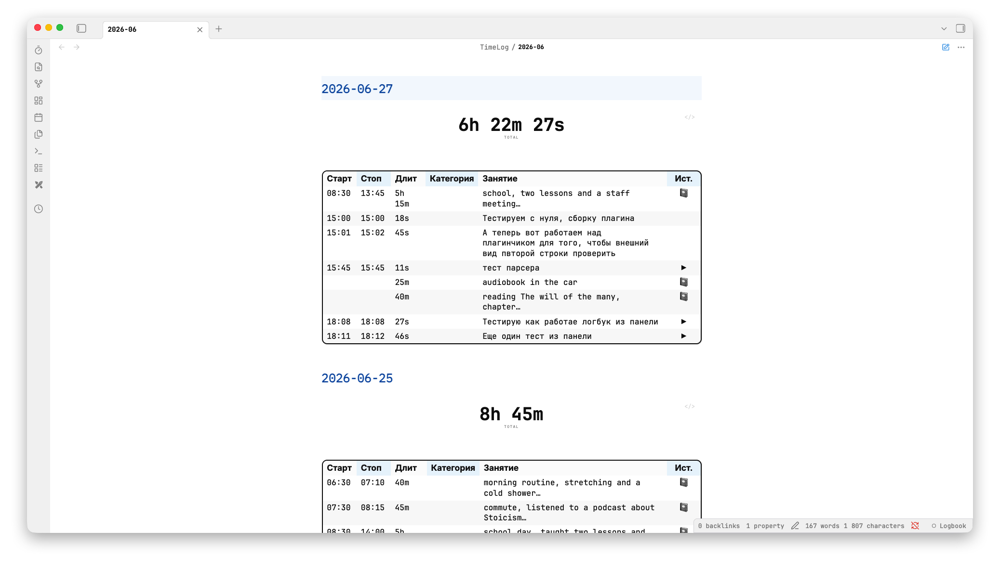
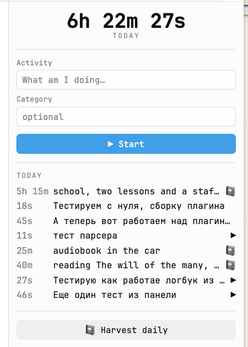
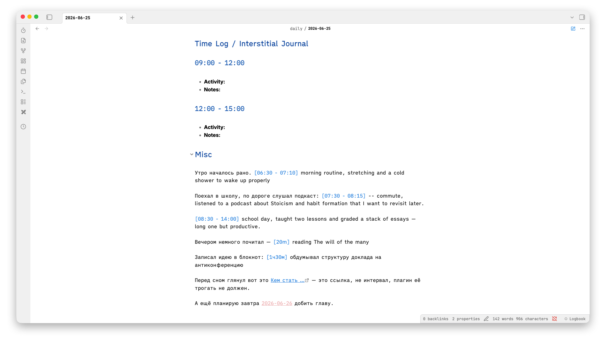

# Logbook

**English** · [Русский](#logbook-русский)

A fast, friction-free **org-clock style time tracker** for [Obsidian](https://obsidian.md).
Start → name the activity → a live timer ticks in the status bar → stop, and the
interval is appended to a monthly logbook file (`TimeLog/YYYY-MM.md`).

It also lets you **harvest time straight from your daily notes**: jot a marker like
`[14:01 - 15:06] worked on the essay` while journaling, and Logbook collects it into
the same monthly log.

> The interface is **bilingual (English / Russian)**. Choose the language in
> *Settings → Logbook → Language*, or leave it on **Auto** to follow Obsidian.

## Features

- ⏱ **One-click stopwatch** — ribbon icon, command, or status-bar click. Live `H:MM:SS` timer.
- 📅 **Monthly logbook** — one file per month, grouped by day, Dataview-friendly markdown table.
- Σ **Per-day totals** — rendered as a big headline number right in the file.
- 🎨 **Styled in the file itself** — the table looks like a dashboard via CSS, no custom renderer.
- 📓 **Harvest from daily notes** — inline markers (`[14:01 - 15:06] …`, `[20m] …`) collected into the log.
- 🔀 **Mixed days** — stopwatch entries (`▶`) and harvested entries (`📓`) coexist, sorted by time.
- 🪟 **Sidebar panel** — today's total, start/stop, live timer, today's entries, and a harvest button.
- 🌐 **Bilingual UI** — English / Russian, auto-detected from Obsidian or set manually.
- 💾 **Survives restarts** — a running session is restored when Obsidian reopens.

## Screenshots

The monthly logbook file — per-day totals and a styled table (`▶` measured with the stopwatch, `📓` harvested from a daily note):



The sidebar panel — today's total, start/stop, live timer, today's entries (shown here with the English UI):



A daily note with inline time markers that get harvested:



Example of a generated `TimeLog/2026-06.md` day section:

```markdown
## 2026-06-25

> [!logbook-total] 8h 45m

| Старт | Стоп  | Длит   | Категория | Занятие                    | Ист. |
|-------|-------|--------|-----------|----------------------------|------|
| 06:30 | 07:10 | 40m    |           | morning routine…           | 📓   |
| 08:30 | 14:00 | 5h 30m |           | school day, taught two…    | 📓   |
| 20:00 | 21:30 | 1h 30m | Research  | worked on the plugin       | ▶    |
```

## Installation

### Via BRAT (recommended for now)

1. Install the **BRAT** community plugin.
2. BRAT → *Add Beta plugin* → paste this repository's URL.
3. Enable **Logbook** in *Settings → Community plugins*.

### Manual

1. Download `main.js`, `manifest.json`, and `styles.css` from the latest [release](../../releases).
2. Copy them into `<your-vault>/.obsidian/plugins/logbook/`.
3. Reload Obsidian and enable **Logbook** in *Settings → Community plugins*.

## Usage

- **Start/stop:** click the ⏱ ribbon icon, the status-bar item, or run the *Logbook* commands.
- **Sidebar panel:** ribbon icon or the *Logbook: open panel* command — start/stop, today's total, today's entries.
- A new month automatically creates a new `TimeLog/YYYY-MM.md` file.

### Harvest from daily notes

Write inline markers anywhere in a daily note named `YYYY-MM-DD.md`:

- `[14:01 - 15:06] description` — an interval (start / stop / duration).
- `[20m] description` (`[1h30m]`, `[45s]`, `[1ч30м]`) — duration only.

Then run **Logbook: harvest from the open daily**. The plugin reads the markers
(it never writes to your daily) and merges them into the monthly log:

- harvested rows are tagged `📓`, stopwatch rows `▶`;
- re-running is idempotent — it replaces only the `📓` rows for that day, keeping `▶` rows;
- the day is sorted by start time and the total recomputed.

Detection only triggers when the brackets contain a time-shaped value, so
`[[wikilinks]]`, `[text](links)` and headings like `### 09:00 - 12:00` are ignored.

## Settings

- **Language** — interface and logbook column language: *Auto* (follow Obsidian), *English*, or *Русский*.
- **Logbook folder** — where monthly files live (default `TimeLog`).
- **File name format** — moment.js format (default `YYYY-MM`).
- **Time format** — for the Start/Stop columns (default `HH:mm`).
- **Words in "activity" when harvesting** — how many words of the daily marker go into the table (default 7).

## Development

```bash
npm install
npm run dev    # watch build
npm run build  # typecheck + production build
```

To auto-copy build artifacts into a test vault during `dev`, set the target plugin
folder via the `OBSIDIAN_PLUGIN_DIR` environment variable or a local (git-ignored)
`.obsidian-plugin-dir` file containing the path.

## Contributing

Issues and PRs welcome — including translations for additional UI languages
(the strings live in `src/i18n.ts`).

## License

[MIT](LICENSE) © Rustam Agamaliev

---

# Logbook (Русский)

[English](#logbook) · **Русский**

Быстрый таймер учёта времени в стиле **org-clock** для [Obsidian](https://obsidian.md).
Старт → название занятия → живой таймер тикает в статус-баре → стоп, и интервал
дозаписывается в месячный файл-логбук (`TimeLog/YYYY-MM.md`).

Ещё умеет **собирать время прямо из дейликов**: пишете по ходу журнала пометку вроде
`[14:01 - 15:06] писал эссе`, а Logbook переносит её в тот же месячный лог.

> Интерфейс **двуязычный (английский / русский)**. Язык выбирается в
> *Настройки → Logbook → Язык*, либо оставьте **Авто**, чтобы он следовал за Obsidian.

## Возможности

- ⏱ **Секундомер в один клик** — иконка на ленте, команда или клик по статус-бару. Живой таймер `H:MM:SS`.
- 📅 **Месячный логбук** — один файл на месяц, сгруппирован по дням, markdown-таблица, дружелюбная к Dataview.
- Σ **Итоги по дням** — выводятся крупным числом-заголовком прямо в файле.
- 🎨 **Стилизовано в самом файле** — таблица выглядит как дашборд за счёт CSS, без кастомного рендерера.
- 📓 **Сбор из дейликов** — встроенные пометки (`[14:01 - 15:06] …`, `[20m] …`) попадают в лог.
- 🔀 **Смешанные дни** — записи секундомера (`▶`) и собранные из дейликов (`📓`) живут рядом, сортируются по времени.
- 🪟 **Боковая панель** — итог за сегодня, старт/стоп, живой таймер, сегодняшние записи и кнопка сбора.
- 🌐 **Двуязычный интерфейс** — английский / русский, автоопределение из Obsidian или выбор вручную.
- 💾 **Переживает перезапуск** — запущенная сессия восстанавливается при повторном открытии Obsidian.

## Скриншоты

Месячный файл-логбук — итоги по дням и стилизованная таблица (`▶` — замерено секундомером, `📓` — собрано из дейлика):


Боковая панель — итог за сегодня, старт/стоп, живой таймер, сегодняшние записи (здесь показан английский UI):


Дейлик со встроенными пометками времени, которые собираются в лог:


Пример сгенерированной секции дня в `TimeLog/2026-06.md`:

```markdown
## 2026-06-25

> [!logbook-total] 8h 45m

| Старт | Стоп  | Длит   | Категория | Занятие                    | Ист. |
|-------|-------|--------|-----------|----------------------------|------|
| 06:30 | 07:10 | 40m    |           | утренние дела…             | 📓   |
| 08:30 | 14:00 | 5h 30m |           | школьный день, два урока…  | 📓   |
| 20:00 | 21:30 | 1h 30m | Research  | работал над плагином       | ▶    |
```

## Установка

### Через BRAT (пока рекомендуемый способ)

1. Установите community-плагин **BRAT**.
2. BRAT → *Add Beta plugin* → вставьте URL этого репозитория.
3. Включите **Logbook** в *Настройки → Community plugins*.

### Вручную

1. Скачайте `main.js`, `manifest.json` и `styles.css` из последнего [релиза](../../releases).
2. Скопируйте их в `<ваш-волт>/.obsidian/plugins/logbook/`.
3. Перезагрузите Obsidian и включите **Logbook** в *Настройки → Community plugins*.

## Использование

- **Старт/стоп:** клик по иконке ⏱ на ленте, по элементу статус-бара или через команды *Logbook*.
- **Боковая панель:** иконка на ленте или команда *Logbook: open panel* — старт/стоп, итог за сегодня, сегодняшние записи.
- Новый месяц автоматически создаёт новый файл `TimeLog/YYYY-MM.md`.

### Сбор из дейликов

Пишите встроенные пометки где угодно в дейлике с именем `YYYY-MM-DD.md`:

- `[14:01 - 15:06] описание` — интервал (старт / стоп / длительность).
- `[20m] описание` (`[1h30m]`, `[45s]`, `[1ч30м]`) — только длительность.

Затем запустите **Logbook: harvest from the open daily**. Плагин читает пометки
(он никогда не пишет в ваш дейлик) и сливает их в месячный лог:

- собранные строки помечаются `📓`, строки секундомера — `▶`;
- повторный запуск идемпотентен — заменяются только строки `📓` за этот день, строки `▶` сохраняются;
- день сортируется по времени старта, итог пересчитывается.

Распознавание срабатывает только когда в скобках значение в форме времени, поэтому
`[[вики-ссылки]]`, `[текст](ссылки)` и заголовки вроде `### 09:00 - 12:00` игнорируются.

## Настройки

- **Язык** — язык интерфейса и колонок логбука: *Авто* (следует за Obsidian), *English* или *Русский*.
- **Папка логбука** — где лежат месячные файлы (по умолчанию `TimeLog`).
- **Формат имени файла** — формат moment.js (по умолчанию `YYYY-MM`).
- **Формат времени** — для колонок Старт/Стоп (по умолчанию `HH:mm`).
- **Слов в «занятии» при сборе** — сколько слов из пометки в дейлике попадёт в таблицу (по умолчанию 7).

## Разработка

```bash
npm install
npm run dev    # сборка в режиме watch
npm run build  # проверка типов + продакшен-сборка
```

Чтобы при `dev` артефакты сборки автоматически копировались в тестовый волт, задайте
папку плагина через переменную окружения `OBSIDIAN_PLUGIN_DIR` или локальный
(игнорируемый git) файл `.obsidian-plugin-dir` с путём.

## Участие

Issue и PR приветствуются — включая переводы интерфейса на другие языки
(строки лежат в `src/i18n.ts`).

## Лицензия

[MIT](LICENSE) © Rustam Agamaliev
